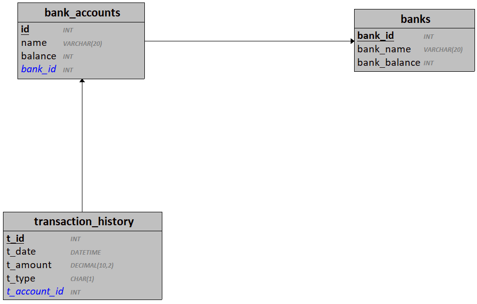

# Bank Accounts 

Objectif : Analyser un système existant et le faire évoluer selon un cahier des charges.

## Contexte actuel 

Le système actuel référence des banques et les comptes bancaires associés.

Un compte bancaire ne peut pas voir son solde descendre sous 0 (aucun découvert autorisé).

Le système permet le transfert de fonds entre les différents comptes bancaires enregistrés.

Chaque transaction entre les comptes bancaires et enregistrée dans un journal (transaction_history).

### État du système actuel 

## Modifications à apporter 

1. Le système doit permettre d'enregistrer les revenus dans le journal
    - Créer une procédure stockée permettant de créditer un montant à un compte bancaire existant
    - Chaque crédit doit être enregistré avec le type "R"
2. Le système doit permettre d'enregistrer les prélèvements dans le journal
    - Créer une procédure stockée permettant de débiter un montant à un compte bancaire existant
    - Chaque débit doit être enregistré avec le type "P"
        - Si le débit échoue (solde du compte insuffisant), il est enregistré avec le type "E"
3. Le système doit permettre d'enregistrer les demandes de prêts (type crédit à la consommation)
    - un client peut contracter un prêt auprès de sa banque uniquement
    - un prêt peut avoir 3 états :
        - "A" : le prêt est en attente de la décision de la banque
        - "N" : le prêt a été refusé
        - "Y" : le prêt a été accepté
    - à l'ajout (insert) d'un nouveau , il est obligatoirement en état "attente"
    - une mise à jour (update) d'un prêt existant permet de modifier l'état du prêt en accepté ou refusé
    - le montant du prêt doit être compris entre 1000€ et 100000€
    - lorsqu'un prêt est accepté, le compte bancaire associé est crédité du montant du prêt

## Travail à réaliser 

1. Analyser le système bancaire existant.
    - Vous disposez :
        - du script SQL de création de la base de données
        - des diagrammes conceptuels et logiques associés
2. Créer un script SQL "BankAccounts_v2_UPDATE.sql"
    - Vous y ajouterez votre code SQL
3. Ajouter la gestion des prélèvements
    - Créer la ou les tables nécessaires
    - Créer les procédures stockées et déclencheurs nécessaires
4. Ajouter la gestion des prélèvements
    - Créer la ou les tables nécessaires
    - Créer les procédures stockées et déclencheurs nécessaires
5. Ajouter la gestion des prêts
    - Modifiez le MCD
    - Créer la ou les tables nécessaires
    - Créer les procédures stockées et déclencheurs nécessaires
